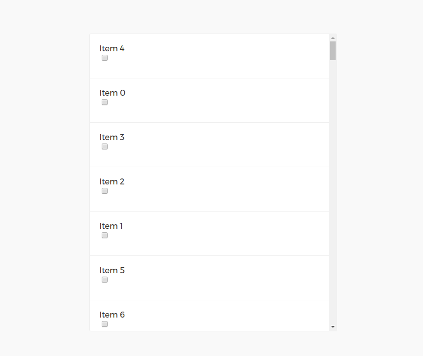

# React-Drag n Drop



## About
Using React.js, React-Dom and React-sort, React-Drag_Sort is built.
This React-Drag n Drop example is written by [Big Silver].

## Quick Start

```bash
# clone our repo
$ git clone https://github.com/Big-Silver/React-Drag_Sort.git reat-sort

# change directory to your app
$ cd reat-sort

# install the dependencies with npm
$ npm install

# start the server
$ npm start
```
